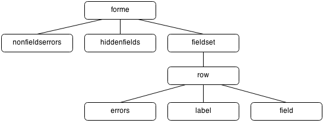

.. _tag_reference:

Tag reference
=============

``django-forme`` provides eight tags:

``forme``
   Top level tag which renders form or forms.

``nonfielderrors``
   Renders form's non field errors.

``hiddenfields``
   Renders hidden fields.

``fieldset``
   Renders set of fields. By default it's just wrapper around all rows.

``row``
  Renders one field row consisting of ``errors``, ``label`` and ``field``.

``errors``
  Renders field errors.

``label``
  Renders label associated with field.

``field``
  Renders field itself.

Usage of paired tags
--------------------

Each of tags above can be used as paired or single tag depending on parameters.
In general, paired tags are used to specify templates, while unpaired tags are
used to render directly using default templates.

Examples:

.. highlight:: html+django

* Renders form using default template::

   

* Renders form using custom template::

   
     
     
     

       
     

   

Tag hierarchy
-------------

Default templates are required to define tags in following hierarchy:

It's not allowed to include parent tags under child ones (eg. ``row`` within
``field`` isn't allowed). However, it is allowed to define child tags
on higher levels than in diagram shown above. These tags are considered as
template definitions::

   
     
       
         

           ...
         

       
     

     
       
         

           ...
         

       
   

In the example above, fields *username* and *email* will be rendered with
template defined by ``field`` tag under ````
tag. Fields *password* and *password1* will be rendered using different template
defined by ``field`` tag under second ``fieldset`` tag. The difference between
keywords ``using`` and ``replace`` is described below.

Rendered html might look like this::

   

     

       <input name="username" ... />
     

   

   

     

       <input name="email" ... />
     

   

   

     

       <input name="password" ... />
     

   

   

     

       <input name="password" ... />
     

   

General tag syntax
------------------

Each of eight tags accepts the same parameters. General valid format is::

   

where:

``tag``
   is valid tag name as described in :ref:`tag_reference`

``target``
   is target to render. It's either form to render (for ``forme`` tag) or
   field(s). While form must be variable containing django form object, fields
   can be specified either by template variables or string. Multiple fields
   can be specified using space separated string. Tags bellow are equal::

   
   

 ``action``
   The default action is "render tag using default template". When ``replace``
   or ``using`` keyword are set, defined templates override the default ones.
   Difference between these two actions is detaily described below.

.. note::

   When action ``using`` or ``replace`` is set, the tag is considered
   as **paired** one.

Tag without any parameters just defines placeholder, where the tag will be
rendered using information available in template context. Only exception is
``forme`` tag, which always requires either ``target`` or ``action``.

Difference between ``using`` and ``replace``
~~~~~~~~~~~~~~~~~~~~~~~~~~~~~~~~~~~~~~~~~~~~

Both actions are used to override default templates. When ``replace`` is used,
only child tags templates are overriden, otherwise is overriden also template
of tag itself.

Consider following default template::

   
      
         <fieldset>
           
         </fieldset>
      

      
      

         
         
         
      

      

When this template is used to render form using bellow template::

   
      
         
            

                
                
                
            

         
      
   

the output for form with one field might look like this::

  <fieldset>
    

       ...
    

  </fieldset>

1. ``<fieldset>...</fieldset>`` tag is preserved, because ````
overrides only child tags templates (only ``row`` tag in this case) keeping
fieldset template untouched.

2. ``row`` tag template is overriden, because ```` overrides
also row template.

Also note, the same output we would get even with this template::

   
     
       

          
          
          
       

     
   
